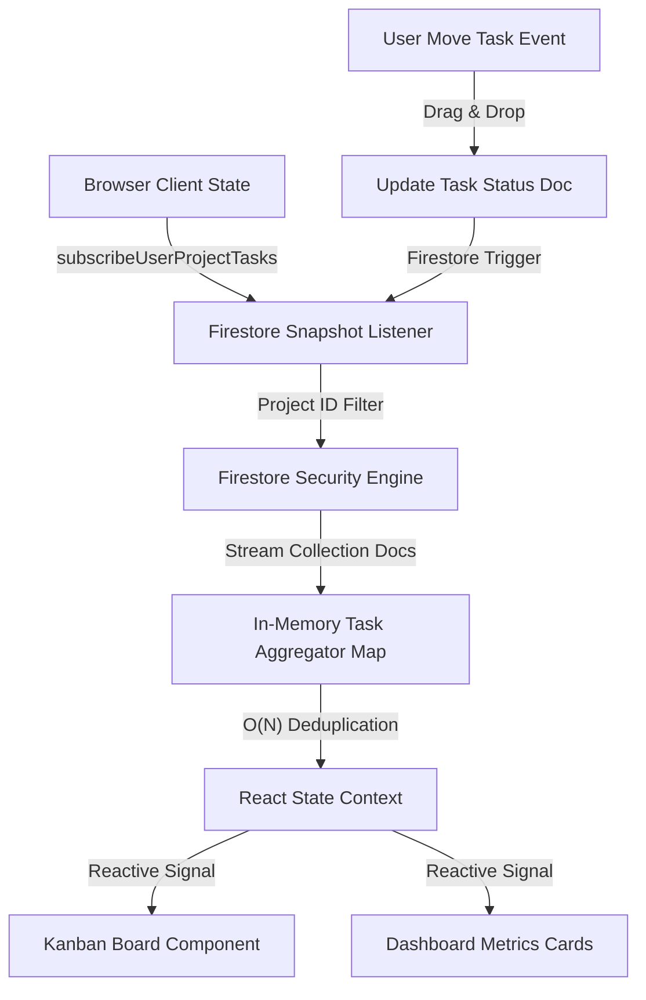
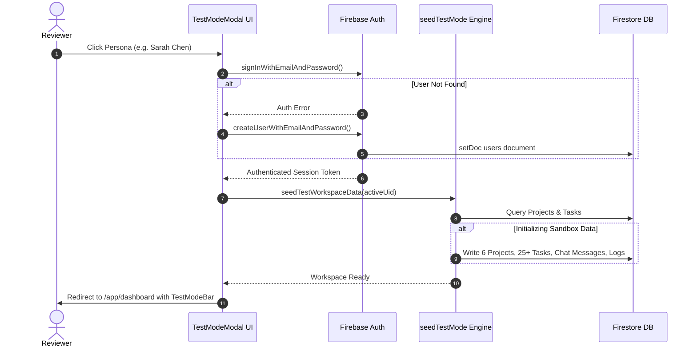
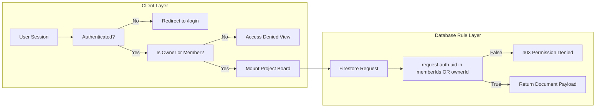
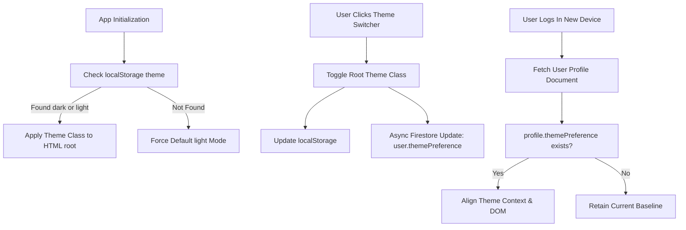
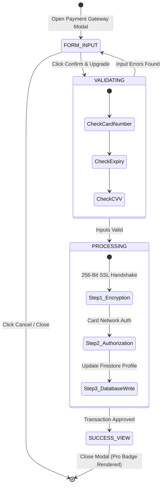
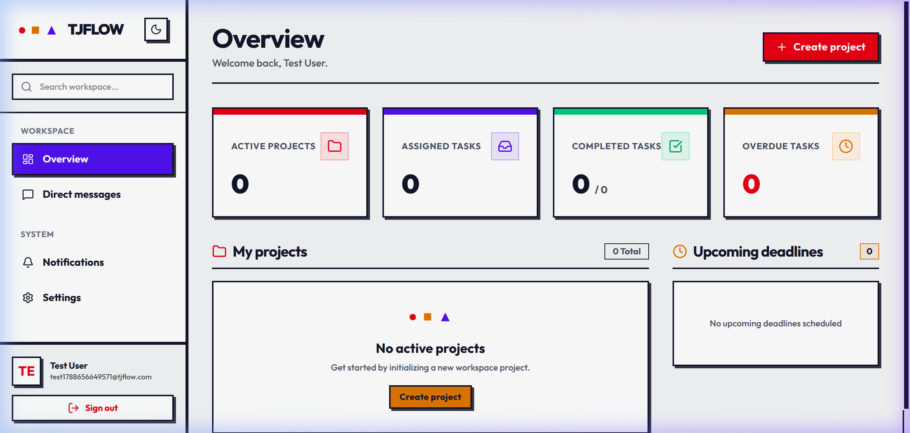
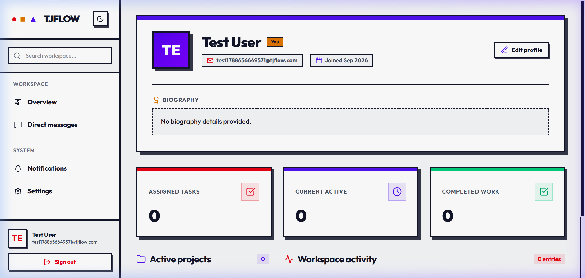
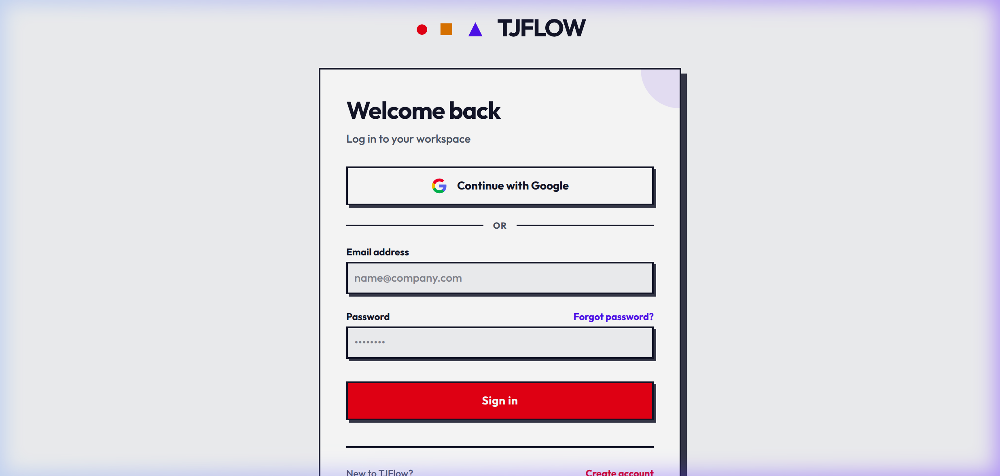
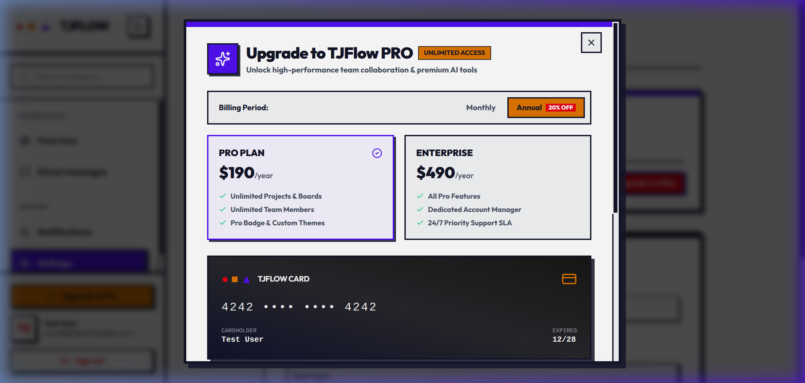
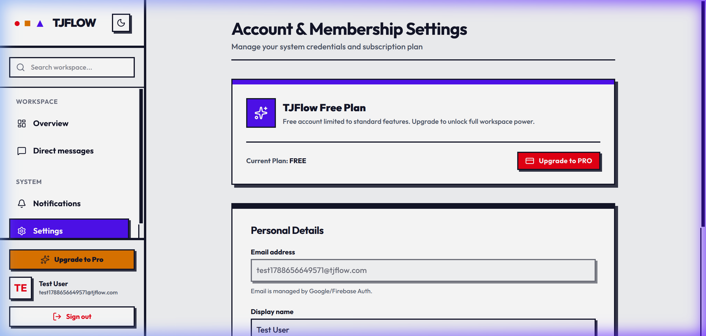

# TJFLOW — Real-Time Workspace & Collaborative Task Management Platform
**Open the site**: https://tj-tasks-2026-shubhr-gunjan.vercel.app/

**Repository**: `TJ-Tasks-2026-Shubhr_Gunjan`  
**Developer**: Shubhr Gunjan ([shubhrrgunjan@gmail.com](mailto:shubhrrgunjan@gmail.com))

---

## Executive Overview

TJFlow is a real-time collaborative workspace engineered for modern product teams. Built on React 18, TypeScript, TailwindCSS v4, and Firebase (Authentication & Firestore), TJFlow unifies multi-project Kanban management, direct & channel messaging, role-based activity streams, and dynamic workspace metrics into a single high-performance interface.

The application adheres to a high-contrast Neo-Brutalist design system, utilizing geometric priority indicators (High ●, Medium ■, Low ▲) to maximize cognitive clarity and eliminate visual clutter.

---

## Reviewer Quick Start: Instant Test Mode

To evaluate the platform at scale without creating accounts or filling forms, TJFlow includes a built-in **Reviewer Test Mode**. Test Mode populates the workspace with 4 active product projects, 15+ detailed Kanban tasks across all workflow stages, project chat channels, direct message threads, activity streams, and notifications.

### How to Access Test Mode
1. Open the landing page (`/`), login page (`/login`), or register page (`/register`).
2. Click the **Reviewer Test Mode** button in the header or hero banner.
3. Select any of the 4 pre-seeded team personas:
   - **Sarah Chen** — Lead Product Designer (Owner of Mobile Redesign & Design System)
   - **Alex Rivera** — Senior Fullstack Engineer (Owner of Infrastructure Migration)
   - **Elena Rostova** — VP of Product & Operations (Manager & Pro Subscriber)
   - **Devon Vance** — Lead QA & Security Auditor (Security & Bug Tracker)
4. Or click **Launch Instant Test Mode** to log directly into the pre-populated sandbox.

### Live Real-Time Multi-User Testing
To experience real-time synchronization live:
1. Open two browser windows side-by-side (or open an Incognito window).
2. Log into Window 1 as **Sarah Chen** and Window 2 as **Alex Rivera**.
3. Move a task on the Kanban board or send a message in `#general` chat in Window 1.
4. Watch the updates propagate **instantly** to Window 2 without reloading the page.
5. Use the sticky top **Test Mode Bar** to switch personas or click **Reset Dummy Data** at any time to restore the original seed state.

---

## System Architecture & Technical Mechanisms

### 1. Real-Time Data Synchronization Engine

TJFlow bypasses traditional REST polling by establishing reactive Firestore document listeners (`onSnapshot`). To prevent excessive listener fan-out and multi-query index failures, project data is requested scoped to authorized project IDs (`pids`), aggregated in memory, and deduplicated in single-pass $O(N)$ dictionary lookups.



### 2. Reviewer Test Mode Sandbox Pipeline

The Test Mode sandbox dynamically manages authentication state and data seeding. When a reviewer selects a persona, the system verifies account credentials against Firebase Auth, instantiates missing profiles, and executes `seedTestWorkspaceData()` to inject pre-built project boards, tasks, comments, and channels.



### 3. Dual-Layer Workspace Multi-Tenancy & Security Matrix

Security in TJFlow operates on two levels: client-side route guards and database-enforced security rules. Users only receive access to projects where their `uid` matches `ownerId` or exists inside `memberIds`.



### 4. Dual-Layer Theme Engine with Cloud Persistence

To maintain visual consistency across devices, TJFlow implements an OS-independent theme engine. The initial render enforces a universal Light mode baseline to prevent unexpected system overrides. When a user toggles dark mode, the state is persisted both to `localStorage` and synchronized to the user's Firestore profile (`users/{uid}.themePreference`).



### 5. Payment Gateway Simulation State Machine

The Pro subscription upgrade workflow operates as a 3-step finite state machine. It validates simulated credit card details in real time using input formatters, executes a step-by-step authorization simulation (Encryption Check -> Bank Authorization -> Account Upgrade), and updates the user's database document (`isPro: true`, `subscriptionPlan: 'PRO'`).



---

## Detailed Interface Walkthrough

### 1. Main Workspace Overview
The workspace dashboard displays user task counts (Assigned, In Progress, Completed), project velocity progress bars, active project cards, and recent activity logs. Accent border colors delineate project priority and status.



### 2. User Profile & Activity Stream
The user profile page aggregates individual performance metrics, active assignments, personal bio, and audited event logs. Every project creation, task move, and member addition is recorded with timestamps.



### 3. Direct Google OAuth Authentication
TJFlow provides seamless 1-click Google authentication via OAuth 2.0 popup authorization, automatically provisioning Firestore user profile documents upon first sign-in.



### 4. Interactive Payment Gateway Modal
The pseudo payment gateway allows reviewers to test subscription upgrades. It features billing frequency toggles, a live CSS gradient credit card preview widget, and step-by-step transaction authorization.



### 5. Workspace Settings & Membership Management
The settings panel enables users to manage profile display names, inspect active subscription plans, toggle themes, and manage security credentials.



---

## Tech Stack & Dependencies

- **Core Framework**: React 18.3, TypeScript 5.6, Vite 6.4
- **Styling**: TailwindCSS v4.3 (Neo-Brutalist design tokens, custom cubic-bezier keyframes)
- **Backend & Database**: Firebase 12.18 (Authentication, Cloud Firestore real-time listeners)
- **Icons**: Lucide React 1.34
- **Routing**: React Router DOM 7.1

---

## Local Setup & Development

### Prerequisites
- Node.js `v18.x` or higher
- npm `v9.x` or higher

### Step-by-Step Setup

1. **Clone the repository**:
   ```bash
   git clone https://github.com/shubhrrgunjan/TJ-Tasks-2026-Shubhr-Gunjan.git
   cd TJ-Tasks-2026-Shubhr-Gunjan
   ```

2. **Install dependencies**:
   ```bash
   npm install
   ```

3. **Start local development server**:
   ```bash
   npm run dev
   ```
   Open `http://localhost:5173` in your browser.

4. **Build production bundle**:
   ```bash
   npm run build
   ```

---

## License

Developed for **TJ-Tasks 2026**. All rights reserved.
